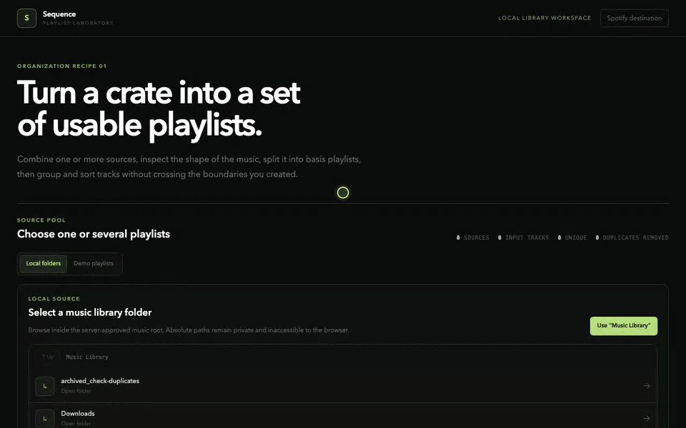

# Spotify Playlist Optimizer

An early full-stack foundation for **Sequence**, a web app that turns one or more source
playlists into clearly defined output playlists using musical-feature distributions, nested
groups, and scoped sorting—without modifying the originals.

## Demo



The demo uses fictional fixture playlists. It changes the energy split from three to four basis
playlists, then shows the destination choices and complete ordered-track preview.

## Core organization workflow

Sequence treats playlist organization as a visible, composable pipeline:

1. **Select inputs:** choose one or multiple source playlists to form a working track pool.
2. **Inspect a distribution:** choose a feature such as energy or danceability and see its
   distribution before deciding how to organize the tracks.
3. **Split into basis playlists:** partition the working pool into levels or bins. Each bin
   becomes a separate proposed output playlist.
4. **Optionally subgroup:** divide the tracks inside each basis playlist into contiguous chunks
   using another feature. Subgrouping retains every track in the same playlist; it creates
   visible sections, not additional output playlists.
5. **Sort at the smallest scope:** choose BPM, key, metadata, or another feature for ordering.
   When subgroups exist, each subgroup is sorted independently so tracks never cross a subgroup
   boundary. Without subgroups, the basis playlist itself is the sort scope.
6. **Preview full track lists:** inspect every proposed playlist and its group boundaries before
   export.

For example, a user can combine two source playlists, split the combined energy distribution
into three basis playlists, subgroup each one into danceability levels, and sort tracks by BPM
inside each danceability group. [ADR 0002](docs/decisions/0002-organization-pipeline-semantics.md)
defines these operation boundaries as product invariants.

## What is working

- React + TypeScript organization workspace with a responsive Tailwind UI
- Multi-playlist input selection and a distribution-first factor-grid, subgroup, and sort workflow
- Full-factorial segmentation across as many as three independently binned parameters
- Proposed-playlist previews with full track lists, visible group boundaries, and a remembered
  comfortable/compact row-density control
- FastAPI service with typed request/response models and OpenAPI docs
- Explicit ReccoBeats and Essentia audio-feature provider choices
- ReccoBeats bulk resolution with partial-coverage reporting and per-track provenance
- Optional, sandboxed Essentia analysis of separately supplied, user-authorized audio
- Metadata-first import of local directories, M3U, and M3U8 files as input playlists
- Persistent, per-playlist Essentia caches that resume partial analysis after reopening and can
  reuse content after a local file is renamed
- Live Essentia progress with current-track timing, whole-run ETA, per-track status, and truthful
  native-DSP versus TensorFlow phase boundaries
- On-demand inline playback of local tracks without preloading the library
- Per-playlist and one-folder batch M3U8 export with no audio-file copying or overwrites
- Native Apple Music batch delivery with a non-mutating dry run and explicit confirmation
- Spotify PKCE connection, reviewed local-to-catalog matching, and create-new playlist delivery
  that is private by default with an explicit public option
- Portable DJ bundles containing ordered M3U8 playlists, Rekordbox XML, and compatibility reports
- Portable MP3-folder export with recipe-ordered folders, track-ordered filenames, exact MP3
  copies, and high-quality conversion of other local formats
- Deterministic equal-width binning, scoped sorting, Camelot key ordering, and missing-data retention
- Camelot key conversion, constraint reporting, explicit-track filtering, and demo fixtures
- Unit tests for the API, strategies, frontend helpers, and native export safety boundaries
- CI for web build/type-check/tests, API lint/tests, native Rust tests, and real FFmpeg/FFprobe
  codec smoke tests

Spotify access and refresh tokens currently live only in the loopback API process, so the user must
connect again after restarting the backend or desktop app. Durable account persistence remains a
later milestone. Fictional demo playlists stay on a separate tab; fixture values are never
relabeled as provider results or sent through an external provider.

## Run locally

Requirements: Node.js 22+, Python 3.12+, and [uv](https://docs.astral.sh/uv/).

```bash
cp .env.example .env
make setup
# Optional: install the pinned Essentia analyzer
make setup-essentia
make dev
```

Then open:

- Web app: <http://localhost:5173>
- API docs: <http://127.0.0.1:8000/docs>

Spotify connection uses Authorization Code with PKCE and only `SPOTIFY_CLIENT_ID`; no client secret
belongs in this local app. In the [Spotify developer dashboard](https://developer.spotify.com/dashboard),
register the browser-development redirect URI exactly as
`http://127.0.0.1:8000/api/v1/spotify/auth/callback`. Development Mode also requires the app owner
to have Spotify Premium and, under Spotify's February 2026 rules, normally allows at most five
authorized users per new app.

Useful checks:

```bash
make test
make lint
make build
# Real FFmpeg/FFprobe smoke for FLAC, Opus, and DFF/DSDIFF conversion
make test-mp3-export-smoke
```

## Run as a macOS app

The Tauri 2 desktop shell packages the React build and a PyInstaller-frozen FastAPI/Essentia
sidecar into one local `.app`. The native app owns port `8001`, leaving the browser development
stack on ports `5173` and `8000`. It also exposes a real macOS folder picker; choosing a library
updates the sidecar's authorized music root, and only an explicitly added playlist reads track
files.

The desktop Spotify redirect must be separately registered exactly as
`http://127.0.0.1:8001/api/v1/spotify/auth/callback`. The sidecar sets that value automatically.
The webview delegates authorization to a native command that accepts only the app's complete HTTPS
`accounts.spotify.com/authorize` request: the exact desktop redirect, `response_type=code`, the
known playlist scopes, a client ID with the backend's expected shape, and bounded URL-safe `state`
and S256 challenge values. Duplicate, missing, or unexpected query fields are rejected; the command
is intentionally not a general URL opener. Native shape validation cannot independently identify
the configured client ID, so the exact loopback callback and the sidecar's one-time `state` binding
remain authoritative.

Requirements: Rust 1.88+, Xcode command-line tools, macOS 15.2 or newer, and network access during
the first desktop build so the pinned Essentia runtime and official model artifacts can be
provisioned. Portable MP3 transcoding additionally requires an `ffmpeg` executable with the
`libmp3lame` encoder. The current development Mac uses Homebrew FFmpeg.

```bash
npm run desktop:build
open "src-tauri/target/release/bundle/macos/Playlist Optimizer.app"
```

`desktop:build` installs the locked TensorFlow-enabled Essentia dependency, provisions all nine
model/metadata artifacts, and bundles them under the app's Resources directory. The installed app
configures the model path automatically and performs no model download at startup or analysis time.

The portable MP3 exporter invokes FFmpeg only when a source is not already an MP3; existing MP3s
do not need FFmpeg. The current build checks `SEQUENCE_FFMPEG_PATH`, an app-resource location,
the Apple Silicon and Intel Homebrew locations, and finally the app's `PATH`. It therefore works
on this configured development Mac even when Finder does not inherit Homebrew's path, but the
packaged `.app` is not yet self-contained for transcoding. A distributable app must bundle a
pinned, architecture-appropriate FFmpeg executable in its signed Resources directory. That
build's codecs and license obligations also require a release audit.

The resulting app bundle is unsigned and intended for local testing. Distributing it to other
Macs requires an Apple Developer signing identity and notarization. The Essentia TensorFlow wheel
also includes an FFTW library whose SDK metadata triggers a PyInstaller hardened-runtime warning;
that must be resolved before calling the bundle release-ready.

The first Apple Music import requests macOS Automation access. Sequence always validates the
complete batch first, creates a uniquely named Music folder, never deletes or replaces an existing
playlist, and reads the resulting Music track IDs back to verify each playlist's order.

PostgreSQL is reserved for the persistence milestone and can be started with
`docker compose up -d postgres`.

## Repository layout

```text
apps/
  api/    FastAPI routes, domain models, strategies, and tests
  web/    React preview experience and visualization components
docs/
  decisions/  Architecture, product-semantics, and platform decisions
  PRD.md      Product requirements
```

The optimizer accepts provider-neutral `Track` objects. Spotify metadata, ReccoBeats catalog
matches, Essentia analysis, or another approved source can all map into the same model. Every
external result keeps its provenance, and missing descriptors remain missing.

## Audio-feature providers

The UI makes the provider choice explicit:

- **ReccoBeats** is the default first test. It looks up catalog features using Spotify track IDs
  or ISRCs, needs no API key, and may return only a subset of a playlist. Unmatched tracks stay in
  the playlist and are reported as unresolved.
- **Essentia** analyzes audio files the user is authorized to provide. Install a compatible
  Essentia Python build with `make setup-essentia`, set `ESSENTIA_AUDIO_ROOT`, and submit only
  relative file paths beneath that root. The app does not obtain or analyze Spotify audio.

Provider discovery and feature resolution are available at
`GET /api/v1/audio-features/providers` and `POST /api/v1/audio-features/resolve`. Feature
resolution happens before recipe preview so repeated split, subgroup, and sort changes do not
repeat external analysis.

The initial ReccoBeats check against the supplied 90-unique-track playlist matched 47 tracks
(52.2%). See the [evaluation](docs/reccobeats-evaluation.md) and
[provider decision](docs/decisions/0003-selectable-audio-feature-providers.md).

Essentia currently returns BPM, key/mode and key strength, normalized native danceability,
integrated LUFS, EBU R128 dynamic range, onset rate, beat strength, dynamic complexity,
spectral-centroid brightness, and spectral flux. All are available as distribution, split,
subgroup, sort, and track-inspection parameters. Native raw scores retain their real units and are
not presented as percentages.

The same controls expose model-backed arousal, valence, aggressiveness, party, and relaxed fields.
The desktop build bundles and activates the complete model set automatically. Browser development
can activate it with `make setup-essentia`, `make setup-essentia-models`, and
`ESSENTIA_MODEL_DIR=apps/api/.models/essentia`. Without a complete, separately licensed model
bundle, those fields remain visibly unavailable. The app does not guess them. Arousal is
energy-adjacent but is never relabeled as Spotify energy. See the
[Essentia feature map](docs/essentia-feature-map.md).

Every TensorFlow inference runs in a fresh, single-use worker process. The API supervises one mood
worker at a time, kills it after its result or after a configurable timeout, and retains the native
BPM, key, danceability, loudness, and spectral descriptors if the model worker fails. This process
boundary prevents Essentia's graph lifecycle state from surviving into the next track. ReccoBeats
is unaffected.

The initial External4TB smoke test imported a 13-track M3U without skips and analyzed three full
tracks in 67.9 seconds. See the [Essentia evaluation](docs/essentia-evaluation.md).

## Local folders and playlist files

The frontend defaults to a local-folder workspace when `ESSENTIA_AUDIO_ROOT` is available. Its
folder browser exposes only root-relative directories: navigate to a collection, choose it as the
music library, and its immediate subfolders appear as playlists that can be imported and selected
together. Imported tracks retain their local path mapping, so the selected provider can analyze
them explicitly from the same screen. A demo-playlist tab remains available for UI development.

`POST /api/v1/local-library/import` turns a directory, `.m3u`, or `.m3u8` beneath
`ESSENTIA_AUDIO_ROOT` into an `InputPlaylist`. Import reads tags and duration without running
audio analysis, preserves M3U order, and returns the relative-path map expected by the Essentia
resolver. Unsafe, missing, unsupported, and duplicate entries are reported rather than hidden.
Local-library import and Essentia resolution are restricted to loopback clients. The synchronous
Essentia endpoint accepts at most five tracks per request; the frontend processes an explicitly
started playlist analysis in sequential five-track batches. While it runs, the UI polls a
short-lived loopback progress record and shows the current file, overall and per-track timing,
estimated remaining time, and the two real execution boundaries: combined native decode/DSP and
the isolated TensorFlow mood worker. Every completed batch is atomically
merged into `.sequence/analysis-cache.json` inside the source playlist folder. Re-importing that
folder restores matching measurements immediately, and the frontend analyzes only missing or
changed tracks. The cache stores relative file references, size and modification-time
fingerprints, a SHA-256 content fingerprint for rename recovery, the pinned analysis-profile
version, features, and provenance—never audio bytes or absolute library paths. Metadata matches
remain the instant path; content hashing is only needed for new writes or rename recovery. This
shortcut intentionally cannot detect a content replacement that preserves both size and
modification time. Rename matches write a corrected path entry for later instant restores,
concurrent app instances coordinate cache merges with a filesystem lock, and incomplete TensorFlow
mood results remain retryable instead of being stored under the full-model profile. A cancellable
background-job flow remains the scalability follow-up for large libraries.

Track-row play controls request audio only after the user presses Play. The loopback-only
`GET /api/v1/local-library/audio` route re-resolves each relative path beneath the currently
selected root and supports byte ranges for playback and seeking. Playback stops when its output
playlist disappears, and starting another track stops the previous preview.

This enables two complementary workflows:

1. Use a local folder or playlist file directly in place of a Spotify playlist.
2. Import Spotify metadata, review Spotify-to-local matches, and analyze the confirmed local files.

The first workflow has a backend vertical slice now. Spotify-to-local matching remains a
reviewable next step because DJ edits, remasters, live versions, and extended mixes make
filename-only automatic matching unsafe. See
[ADR 0004](docs/decisions/0004-local-library-inputs.md).

## Spotify catalog matching and delivery

Spotify can receive catalog items, not audio files from the local drive. A local track therefore
must first be matched to a Spotify catalog identity. Sequence prefers an exact ISRC, then reviews
normalized title, artist, duration, and version qualifiers. An ambiguous or unmatched track blocks
confirmation until the user selects a candidate or explicitly excludes that position. Sequence
never makes that choice silently, and local audio bytes are never uploaded.

Connection uses Authorization Code with PKCE, the public client ID, a one-time `state`, and an
S256 code challenge. Tokens and pending PKCE records are currently in memory, so restarting
requires a fresh connection. Importing Spotify playlists as source material is separate follow-up
scope; that reader must use paginated `GET /me/playlists` and
`GET /playlists/{playlist_id}/items`, and can retrieve contents only for eligible owned or
collaborative playlists under the current Development Mode rules.

Spotify export is a reviewed two-step operation. The first step reports every proposed playlist,
ordered catalog match, ambiguity, and omission without changing Spotify. Only a second explicit
confirmation creates new playlists, private by default unless the user explicitly chooses public.
Spotify's Web API cannot create or retrieve playlist
folders, so Sequence preserves output-playlist order with zero-padded names such as
`01 - Low Arousal`, `02 - Medium Arousal`, and so on. It appends catalog URIs to
`POST /playlists/{playlist_id}/items` in canonical preview order, in chunks of no more than 100,
then reads the playlist items back to compare URI order and count. Any rejected or unverifiable
playlist is reported as a partial failure; source playlists are never changed and a partial result
is never labeled complete. A stable UUID binds each confirmed plan to an in-memory replay record,
so a lost desktop response or concurrent retry returns the original result instead of creating a
duplicate batch. The export accepts the recipe builder's full 216-playlist factor grid and safely
truncates numbered Spotify names to 100 Unicode code points. See
[ADR 0008](docs/decisions/0008-spotify-catalog-playlist-delivery.md).

## Apple Music, Rekordbox, and djay Pro delivery

The desktop app offers four deliberate delivery paths after preview:

1. **Apple Music:** first run a filesystem-only dry run, then explicitly create a new, uniquely
   named folder containing every output playlist. Tracks are added sequentially in canonical
   preview order; the result reports every file Music accepts or rejects and verifies the resulting
   order by reading Music's database IDs back. Existing Music data is never overwritten. This is
   the most convenient bridge to djay Pro because djay can browse the Music source and batch-add
   Music playlists to My Collection.
2. **DJ bundle:** save one new folder containing a multi-playlist Rekordbox XML file, one UTF-8
   M3U8 per output, a JSON conservation manifest, and a readable compatibility report. Unsupported
   or unverified extensions are warned about but never silently removed from an otherwise valid
   playlist file.
3. **M3U8 folder:** retain the simple, broadly compatible one-file-per-playlist fallback.
4. **Portable MP3 folders:** create one new export root whose playlist folders are numbered in
   recipe-output order. Inside each folder, MP3 filenames are numbered in canonical preview order,
   so Finder, Rekordbox, djay Pro, and other filename-sorted tools see the intended sequence.
   Existing MP3 sources are copied byte-for-byte; supported non-MP3 audio is converted with LAME's
   highest-quality algorithm mode and a 320 kbps target. Standard MP3 limits lower-rate inputs to a
   lower legal maximum, so the result is **up to** 320 kbps. Source files are never moved, renamed,
   replaced, retagged, or edited.

The import-and-MP3-export path accepts AAC/ADTS, AC-3/E-AC-3, AIFF/AIFC, Monkey's Audio,
DFF/DSDIFF, DSF, FLAC, M4A/M4B (including ALAC in those containers), MP2, MP3, Musepack,
Ogg/Opus/Speex, TAK, True Audio, WAV, WMA, and WavPack. Native export defensively rejects other
extensions before starting FFmpeg. Import/export support does not imply that WebKit can preview
every codec inline, and any file that its metadata parser or FFmpeg cannot read is reported rather
than silently claimed as converted.

The app uses the 320 kbps ceiling to conservatively estimate the transcoded portion at about
2.4 MB per minute before tags and filesystem overhead. Byte-copied MP3s retain their actual size
and are reported separately rather than folded into that estimate. A complete total/free-space
preflight is still a release follow-up.

Transcoding a lossless source produces a convenient high-bitrate MP3, but transcoding an already
lossy AAC, Opus, or similar file cannot restore information and may introduce generation loss.
The bitrate target describes the output, not an improvement over the source.

An MP3 export writes a machine-readable manifest and a readable text report that preserve every
playlist and track position plus the requested copy/transcode operation. If an individual operation
fails, the exporter continues with the remaining tracks, retains successful files, and reports the
failed source, requested operation, and position; it never claims a partial folder is complete.
Re-running creates a new numbered export root rather than overwriting the earlier attempt.

Apple's manual XML import only retains songs already present in the Music library, which is why
the native sequential importer is the primary local-file workflow. Rekordbox supports importing
M3U/M3U8 playlist files, while its XML is useful for handing off several playlists together.
See the [Apple Music playlist guide](https://support.apple.com/en-vn/guide/music/-mus27cd5060f/mac),
[Rekordbox 7.2.14 manual](https://cdn.rekordbox.com/files/20260409151936/rekordbox7.214_manual_EN.pdf),
and [djay Pro collection guide](https://help.algoriddim.com/user-manual/djay-pro-mac/music-library/my-collection).
The detailed portable-copy contract is recorded in
[ADR 0007](docs/decisions/0007-portable-mp3-folder-export.md).

## Important Spotify platform constraint

The PRD assumes new apps can request Spotify Audio Features. That is no longer generally true.
Spotify announced in November 2024 that new Web API apps and development-mode apps would not
have access to Audio Features or Audio Analysis. In February 2026, Spotify also tightened
development mode to five users, required the app owner to have Premium, renamed playlist
`tracks` fields/endpoints to `items`, and limited playlist contents to owned or collaborative
playlists. The Web API also cannot add local files or represent Spotify playlist folders.

This skeleton therefore separates Spotify metadata/OAuth from musical-feature ingestion. It now
offers ReccoBeats and Essentia as disclosed provider options while keeping demo fixtures visibly
separate. See [ADR 0001](docs/decisions/0001-audio-feature-provider.md) for the boundary and
[ADR 0003](docs/decisions/0003-selectable-audio-feature-providers.md) for the implementation.

Official references:

- [November 2024 Web API changes](https://developer.spotify.com/blog/2024-11-27-changes-to-the-web-api)
- [February 2026 migration guide](https://developer.spotify.com/documentation/web-api/tutorials/february-2026-migration-guide)
- [Authorization Code with PKCE](https://developer.spotify.com/documentation/web-api/tutorials/code-pkce-flow)
- [Get Current User's Playlists](https://developer.spotify.com/documentation/web-api/reference/get-a-list-of-current-users-playlists)
- [Get Playlist Items](https://developer.spotify.com/documentation/web-api/reference/get-playlists-items)
- [Add Items to Playlist](https://developer.spotify.com/documentation/web-api/reference/add-items-to-playlist)
- [Playlist local-file and folder limitations](https://developer.spotify.com/documentation/web-api/concepts/playlists)
- [Spotify rate limits](https://developer.spotify.com/documentation/web-api/concepts/rate-limits)

## Delivery roadmap

1. **Foundation (this repository):** provider-neutral optimizer, fixtures, distribution-first
   organization workspace, full track-list previews, and tests.
2. **Spotify catalog delivery:** Authorization Code with PKCE, in-memory loopback session, reviewed
   local-to-catalog matching, create-new playlist export with private-by-default visibility, order
   verification, and partial-failure reporting. Spotify-source playlist import via current
   paginated endpoints and
   durable encrypted account persistence remain follow-up work.
3. **Feature-source hardening:** cache ReccoBeats matches, measure coverage, harden the existing
   per-playlist Essentia cache, and never manufacture unavailable values.
4. **Local identity matching:** review Spotify-to-local candidates using ISRC, title, artist,
   duration, and version qualifiers before analyzing confirmed files.
5. **Organization pipeline:** persist multi-input working sets, configurable distribution bins,
   custom or equal-count bin boundaries, manual membership changes, and saved recipes.
6. **Safe export:** explicit preview confirmation, create-new-playlist default, idempotency,
   chunked writes, and an audit record. Original playlists remain read-only.
7. **Advanced solver:** hard constraints plus beam search/simulated annealing with benchmarks
   against 500-track playlists.

## Product guardrails

- Never modify a source playlist.
- Use Spotify PKCE with the public client ID; do not configure or expose a client secret. Never
  expose access/refresh tokens to the browser.
- Never upload local audio to Spotify. Only explicitly reviewed Spotify catalog URIs may be written.
- Treat album artwork and Spotify metadata according to Spotify attribution policy.
- Do not imply fixture, estimated, or externally sourced features came from Spotify.
- Export is a separate, explicit action after preview—not a side effect of optimization.
- A proposed output is not previewed as a summary card alone; its complete track list remains
  inspectable before export.
- Subgrouping never drops tracks or silently creates more playlists, and sorting never moves a
  track across an established subgroup boundary.
